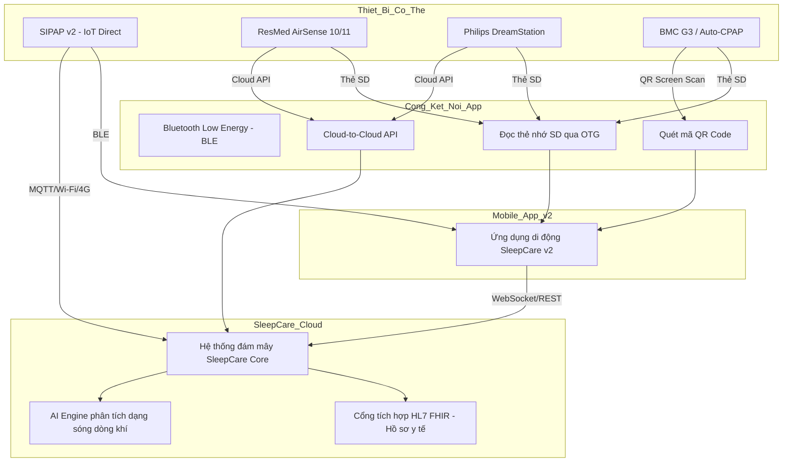

# ĐỀ XUẤT NÂNG CẤP GIẢI PHÁP HỮU ÍCH SLEEPCARE V2
## HỆ THỐNG DI ĐỘNG TƯƠNG TÁC THÔNG MINH GIÁM SÁT SỨC KHỎE GIẤC NGỦ VÀ TẦM SOÁT HỘI CHỨNG NGƯNG THỞ KHI NGỦ TÍCH HỢP ĐA THIẾT BỊ HỖ TRỢ THỞ (CPAP/BIPAP), THIẾT BỊ ĐO ĐA KÝ TẠI NHÀ (HST) VÀ MỞ RỘNG MẠNG LƯỚI NỀN TẢNG SỐ Y HỌC GIẤC NGỦ QUỐC GIA

---

## 1. GIỚI THIỆU CHUNG VÀ TẦM NHÌN CHIẾN LƯỢC

### 1.1. Hiện trạng phiên bản SleepCare v1
Trong phiên bản **SleepCare v1**, hệ thống đã giải quyết được các bài toán cơ bản về tầm soát không xâm lấn hội chứng ngưng thở khi ngủ do tắc nghẽn (OSA):
1. **Số hóa thang đo lâm sàng:** Tích hợp 11 bảng câu hỏi y sinh chuẩn hóa (STOP-BANG, Epworth, Pittsburgh PSQI, trầm cảm Hamilton, lo âu Zung, trẻ em PSQ...).
2. **Phát hiện tiếng ngáy bệnh lý:** Thu âm PCM 16kHz cục bộ trên điện thoại, chạy mô hình AI phát hiện tiếng ngáy kết hợp thuật toán tính decibel phi tuyến tính để cảnh báo tiếng ngáy bệnh lý (>56 dB liên tục trên 10 giây).
3. **Đánh giá môi trường phòng ngủ:** Đo độ sáng (Lux) từ cảm biến hoặc camera trước và độ ồn nền (dB).
4. **Kết nối phần cứng cơ bản:** Giao tiếp không dây Bluetooth Low Energy (BLE) với thiết bị hỗ trợ thở tự chế **SIPAP v1** (sử dụng Arduino Nano 33 BLE, quạt thổi WS4540, cảm biến áp suất MPXV5010G và cảm biến lưu lượng SFM3300-D) để hiển thị áp suất, RPM, PWM thực tế lên ứng dụng di động và đồng bộ lên đám mây SleepCare.

### 1.2. Nhu cầu nâng cấp lên phiên bản SleepCare v2
Để đưa hệ thống từ một giải pháp ứng dụng di động và phần cứng đơn lẻ thành một **nền tảng y khoa chuyển đổi số toàn diện**, SleepCare v2 cần giải quyết các bài toán lớn sau:
- **Tương thích đa thiết bị hỗ trợ thở (CPAP/BiPAP):** Thực tế lâm sàng bệnh nhân sử dụng nhiều dòng máy thở khác nhau của các hãng lớn toàn cầu. Hệ thống không thể chỉ kết nối với một thiết bị SIPAP tự chế mà phải mở rộng khả năng tích hợp và thu thập dữ liệu từ các máy thương mại.
- **Tiêu chuẩn hóa chẩn đoán bằng Home Sleep Test (HST):** Quy trình chẩn đoán OSA bắt buộc phải qua đo đa ký giấc ngủ (PSG) hoặc tối thiểu là đa ký hô hấp tại nhà (HST - Home Sleep Test) từ 4-7 kênh tín hiệu. Tích hợp dữ liệu HST dạng thô (file chuẩn y tế EDF) và ứng dụng thuật toán AI tự động chấm điểm (AI scoring) là yêu cầu cốt lõi để nâng cao độ chính xác y học.
- **Mở rộng thành Mạng lưới Nền tảng số Y học Giấc ngủ Quốc gia:** Phát triển một kiến trúc đám mây y khoa bảo mật, kết nối trực tiếp cơ sở dữ liệu của người bệnh với các bệnh viện chuyên khoa, phòng khám giấc ngủ toàn quốc dưới sự bảo trợ học thuật và chỉ đạo tuyến của **Hội Y học Giấc ngủ Việt Nam (VSSM)**, hướng tới kết nối trực tiếp với hệ thống Hồ sơ sức khỏe điện tử (EHR) quốc gia và Cổng dữ liệu Bộ Y tế.

---

## 2. NÂNG CẤP KHẢ NĂNG TÍCH HỢP THIẾT BỊ HỖ TRỢ THỞ (CPAP/BIPAP) ĐA NỀN TẢNG

Để mở rộng hệ sinh thái, hệ thống SleepCare v2 nâng cấp khả năng kết nối đa phương thức tới cả thiết bị tự chế SIPAP và các dòng máy CPAP/BiPAP thương mại phổ biến.



### 2.1. Phương thức tích hợp thiết bị CPAP/BiPAP thương mại
Hệ thống nâng cấp hỗ trợ kết nối với các thương hiệu máy thở hàng đầu (như *ResMed*, *Philips Respironics*, *BMC Medical*, *Löwenstein Medical*) qua các giao thức:
1. **Cloud-to-Cloud API (Kết nối đám mây liên thông):**
   - Tích hợp API bảo mật của nhà sản xuất (ví dụ: ResMed AirView API, Philips Care Orchestrator API) sử dụng giao thức OAuth 2.0.
   - Tự động đồng bộ báo cáo tuân thủ điều trị định kỳ của bệnh nhân (Compliance Reports) bao gồm: Số giờ sử dụng mỗi đêm, Chỉ số AHI còn lại, Mức rò rỉ khí thở (Leak Rate), Áp suất trung bình (95th percentile pressure).
2. **Giải pháp quét mã QR (QR Code Quick Sync):**
   - Tích hợp mô-đun camera quét mã QR (chức năng iCode của BMC hoặc báo cáo trên màn hình của các dòng máy thở khác).
   - Giải mã chuỗi ký tự dạng nén từ mã QR để lấy ngay dữ liệu lâm sàng: AHI, tỷ lệ rò khí, chỉ số tuân thủ (Compliance Index) của 1 ngày, 7 ngày, 30 ngày qua mà không cần kết nối Internet/Cloud.
3. **Phân tích dữ liệu thẻ nhớ qua OTG (SD Card Analysis):**
   - Phát triển thư viện phân tích cấu trúc file nhị phân của các nhà sản xuất máy thở (như định dạng `.edf` hoặc thư mục cấu trúc ghi dữ liệu nhịp thở của ResMed/Philips).
   - Bệnh nhân rút thẻ SD từ máy thở, cắm vào đầu đọc thẻ OTG kết nối với điện thoại. App SleepCare sẽ đọc trực tiếp dữ liệu dạng sóng dòng khí (Flow Signal) và áp suất (Pressure Signal) độ phân giải cao (25Hz - 50Hz) để hiển thị chi tiết biểu đồ hô hấp trên app.

### 2.2. Nâng cấp khả năng hỗ trợ thiết bị hai mức áp lực (BiPAP)
Khác với dòng CPAP (chỉ cung cấp một mức áp suất dương liên tục), thiết bị BiPAP và các máy thở không xâm lấn chuyên sâu đòi hỏi giám sát và quản lý các thông số phức tạp hơn. SleepCare v2 bổ sung:
- **Giám sát thông số áp lực động:**
    - **IPAP (Inspiratory Positive Airway Pressure):** Áp lực hỗ trợ khi hít vào nhằm giảm công hô hấp.
    - **EPAP (Expiratory Positive Airway Pressure):** Áp lực khi thở ra giúp giữ thông thoáng đường thở.
    - **PS (Pressure Support):** Hiệu số giữa IPAP và EPAP ($PS = IPAP - EPAP$).
- **Theo dõi chỉ số thông khí y học:**
    - **Thể tích khí lưu thông ($V_t$ - Tidal Volume):** Đo bằng đơn vị $ml$, phản ứng mức độ giãn nở phổi.
    - **Thông khí phút ($MV$ - Minute Ventilation):** Lưu lượng khí lưu thông trong một phút ($L/min$).
    - **Tần số thở ($RR$ - Respiratory Rate):** Số nhịp thở mỗi phút ($bpm$).
    - **Tỷ lệ I:E (Inspiratory-to-Expiratory Ratio):** Tỷ lệ thời gian hít vào so với thở ra.
- **Phân loại biến cố ngưng thở sâu:**
    - Phát hiện ngưng thở trung ương (Central Apnea) bằng kỹ thuật sóng xung kích FOT (Forced Oscillation Technique) tích hợp trong máy thở.
    - Phát hiện thở chu kỳ Cheyne-Stokes (CSR - Cheyne-Stokes Respiration), cảnh báo nguy cơ suy tim sung huyết hoặc tai biến mạch máu não đồng hành.

### 2.3. Nâng cấp thiết bị tự chế SIPAP v2
- **Module IoT trực tiếp:** Bổ sung chip phụ ESP32-S3 hoặc module Quectel EG915Q-EU (4G LTE Cat-1) trên mạch chính SIPAP v2. Thiết bị gửi trực tiếp dữ liệu thô (Pressure, Flow, RPM, Error Code) qua giao thức MQTT mã hóa TLS 1.3 về đám mây SleepCare IoT Hub mà không cần điện thoại trung gian.
- **Auto-CPAP/APAP Edge AI:** Nhúng mô hình TinyML trên vi điều khiển chính (Arduino Nano 33 BLE / chip ARM Cortex-M4) để tự động phát hiện sớm hiện tượng xẹp đường thở dựa trên độ dẹt của đường cong lưu lượng khí thở (flow limitation curve), thực hiện tăng giảm áp lực (điều khiển PID vòng kín) tức thời tối ưu cho từng nhịp thở.

---

## 3. TÍCH HỢP CHẨN ĐOÁN VÀ ĐO ĐA KÝ GIẤC NGỦ TẠI NHÀ (HOME SLEEP TEST - HST)

Quy trình sàng lọc ban đầu qua bảng hỏi và tiếng ngáy trên di động cần được xác thực bằng thiết bị y khoa. Tích hợp HST (đa ký hô hấp Class III hoặc Class IV) giúp hoàn thiện chu trình chẩn đoán khép kín tại nhà.

```
+---------------------------------------+
|  1. SÀNG LỌC QUA APP SLEEPCARE V2     | ---> Thang đo ESS, STOP-BANG, đo tiếng ngáy
+---------------------------------------+
                    |
                    v (Nguy cơ cao)
+---------------------------------------+
|  2. CHỈ ĐỊNH ĐO HST TẠI NHÀ           | ---> Bác sĩ duyệt chỉ định qua Doctor Portal
+---------------------------------------+
                    |
                    v (Giao nhận thiết bị)
+---------------------------------------+
|  3. ĐO VÀ ĐỒNG BỘ DỮ LIỆU HST         | ---> Nhận tín hiệu SpO2, Flow, Effort, EEG qua BLE
+---------------------------------------+
                    |
                    v (Upload file EDF)
+---------------------------------------+
|  4. AI SCORED & CLINICAL CONFIRMATION | ---> AI chấm tự động + Bác sĩ duyệt & Ký số
+---------------------------------------+
                    |
                    v (Chỉ định điều trị)
+---------------------------------------+
|  5. THIẾT LẬP CPAP/BIPAP ĐIỀU TRỊ      | ---> Giám sát tuân thủ thời gian thực
+---------------------------------------+
```

### 3.1. Các thiết bị đo đeo HST/PSG tại nhà được hỗ trợ
Hệ thống nâng cấp hỗ trợ kết nối không dây BLE và import dữ liệu từ các thiết bị:
- **Nhẫn thông minh đo $SpO_2$ (Smart Ring):** Thu nhận tín hiệu quang phổ PPG tần số cao để đo liên tục bão hòa oxy máu ($SpO_2$) và nhịp tim, giúp xác định chỉ số giảm oxy máu (Oxygen Desaturation Index - ODI).
- **Thiết bị đo đa ký hô hấp di động (Portable Respiratory Monitor):** Đai ngực đo gắng sức cơ hô hấp (Respiratory Effort), ống thông mũi đo áp suất dòng thở (Nasal Pressure Cannula).
- **Miếng dán điện não ngủ rút gọn (Patch EEG):** Miếng dán trán thu nhận 1 hoặc 2 kênh EEG, hỗ trợ xác định chính xác thời gian ngủ thực tế (Total Sleep Time - TST) nhằm phân biệt với thời gian nằm trên giường (Time in Bed), nâng cao độ chính xác của chỉ số AHI.

### 3.2. Chuẩn hóa dữ liệu y tế bằng định dạng EDF (European Data Format)
- **Chuẩn EDF/EDF+:** Đây là định dạng chuẩn quốc tế để lưu trữ các tín hiệu sinh lý y khoa (EEG, ECG, EMG, SpO2, Airflow). SleepCare v2 phát triển trình phân tích file EDF trực tiếp trên Server đám mây, cho phép các bác sĩ và hệ thống AI đọc, vẽ biểu đồ đa kênh đồng bộ thời gian thực của toàn bộ giấc ngủ (thường kéo dài 6-8 tiếng).

### 3.3. Thuật toán AI Cloud Scoring tự động chấm điểm giấc ngủ
Hệ thống AI chạy trên đám mây sử dụng các mạng học sâu tiên tiến (như CNN kết hợp Transformer) thực hiện:
- **Phát hiện biến cố hô hấp tự động:** Nhận dạng các cơn ngừng thở do tắc nghẽn (Obstructive Apnea), ngừng thở trung ương (Central Apnea), giảm thở (Hypopnea) và sự sụt giảm bão hòa oxy máu tương ứng.
- **Phân loại giai đoạn giấc ngủ (Sleep Staging):** Phân tích tín hiệu điện não đồ (EEG) và cử động để nhận dạng chu kỳ giấc ngủ: Thức (Wake), Ngủ nông (Light Sleep - N1, N2), Ngủ sâu (Deep Sleep - N3), Ngủ mơ (REM).
- **Sinh báo cáo chẩn đoán tự động (Auto-generated Report):** Tính toán các chỉ số lâm sàng quan trọng:
  - **AHI (Apnea-Hypopnea Index):** Tổng số cơn ngừng thở và giảm thở trên mỗi giờ ngủ.
  - **ODI (Oxygen Desaturation Index):** Số lần bão hòa oxy máu giảm $\ge 3\%$ hoặc $4\%$ mỗi giờ.
  - **T90:** Phần trăm thời gian ngủ có mức $SpO_2 < 90\%$.
  - **Arousal Index:** Số lần thức giấc vi thể mỗi giờ ngủ.

---

## 4. MỞ RỘNG THÀNH MẠNG LƯỚI NỀN TẢNG SỐ Y HỌC GIẤC NGỦ QUỐC GIA

Hệ thống SleepCare v2 chuyển đổi từ một ứng dụng di động độc lập thành **Hạ tầng số Y học Giấc ngủ Quốc gia**, vận hành như một hệ sinh thái mở kết nối bệnh nhân, cơ sở y tế và các nhà quản lý dịch tễ.

### 4.1. Kiến trúc hệ thống tổng thể (Platform Architecture)
Hạ tầng số SleepCare v2 được xây dựng trên mô hình đám mây phân tán, đáp ứng tải cao và bảo mật y tế:

1. **Lớp dịch vụ dữ liệu tiêu chuẩn HL7 FHIR (Fast Healthcare Interoperability Resources):**
   - Số hóa toàn bộ hồ sơ bệnh án giấc ngủ theo chuẩn FHIR (các tài nguyên như `Patient`, `Observation`, `DiagnosticReport`, `Device`).
   - Cung cấp cổng API mở (RESTful API, GraphQL) để liên thông dữ liệu hai chiều với hệ thống Quản lý bệnh viện (HIS), Bệnh án điện tử (EMR) của các bệnh viện đa khoa và chuyên khoa trên toàn quốc.
2. **Định danh số y tế tích hợp VNeID/SSO:**
   - Kết nối với Cơ sở dữ liệu quốc gia về dân cư thông qua hệ thống định danh VNeID của Bộ Công an. Người dân đăng nhập bằng tài khoản định danh điện tử quốc gia để tạo hồ sơ bệnh án giấc ngủ chính xác, chống giả mạo và liên thông kết quả xét nghiệm giữa các bệnh viện.
3. **Mạng lưới IoT Hub quốc gia:**
   - Quản lý hàng vạn thiết bị CPAP/BiPAP và máy đo HST đang hoạt động trên toàn quốc. IoT Hub thực hiện thu thập, phân luồng dữ liệu thời gian thực và giám sát trạng thái thiết bị y tế từ xa.

### 4.2. Mô hình vận hành mạng lưới y tế giấc ngủ 3 cấp

```
                   HỘI Y HỌC GIẤC NGỦ VIỆT NAM (VSSM)
                   BỘ Y TẾ / TRUNG ƯƠNG (CẤP 3)
                   - Chỉ đạo chuyên môn, hội chẩn ca khó.
                   - Giám sát dịch tễ, lập bản đồ nguy cơ quốc gia.
                                ▲
                                │ (Hội chẩn / Chuyển tuyến)
                                ▼
                   BỆNH VIỆN TUYẾN TỈNH / HUYỆN (CẤP 2)
                   - Khám lâm sàng, chỉ định & cấp phát máy đo HST.
                   - Chẩn đoán xác định, kê đơn điều trị CPAP/BiPAP.
                                ▲
                                │ (Khám chỉ định / Chuyển tuyến)
                                ▼
                   Y TẾ CƠ SỞ & CỘNG ĐỒNG (CẤP 1)
                   - Người dân tự tầm soát trên app SleepCare v2.
                   - Trạm y tế xã sàng lọc ban đầu bằng bảng hỏi lâm sàng.
```

- **Cấp 1 (Y tế cơ sở và Cộng đồng):**
  - Người dân tự tải ứng dụng SleepCare v2, làm bài kiểm tra sàng lọc và tự ghi âm tiếng ngáy tại nhà. Trạm y tế xã/phòng khám ban đầu sử dụng app để sàng lọc hàng loạt cho người dân, đặc biệt là nhóm đối tượng nguy cơ cao (lái xe đường dài, người béo phì, bệnh nhân cao huyết áp khó kiểm soát).
- **Cấp 2 (Bệnh viện tuyến Tỉnh/Huyện):**
  - Khi app cảnh báo nguy cơ cao (STOP-BANG $\ge 3$, ngáy bệnh lý), bệnh nhân được chỉ dẫn đến bệnh viện tuyến huyện hoặc tỉnh gần nhất. Bác sĩ tại đây sẽ duyệt yêu cầu đo đa ký giấc ngủ trên **Doctor Portal**, cấp thiết bị HST cho bệnh nhân mang về nhà ngủ 1 đêm.
  - Sáng hôm sau, dữ liệu HST đồng bộ tự động lên hệ thống, AI thực hiện tiền phân tích. Bác sĩ duyệt kết quả, đưa ra chẩn đoán xác định và kê đơn điều trị bằng máy thở áp lực dương (CPAP/BiPAP). Báo cáo chẩn đoán được ký số y khoa (Digital Signature) và trả kết quả về app của bệnh nhân.
- **Cấp 3 (Hội Y học Giấc ngủ Việt Nam - VSSM & Bệnh viện Trung ương):**
  - Quản lý các ca bệnh phức tạp (như ngưng thở hỗn hợp, ngưng thở trung ương do tổn thương thần kinh, suy tim giai đoạn cuối). Các chuyên gia đầu ngành có thể truy cập Doctor Portal để xem dữ liệu thô dạng sóng EDF của các ca bệnh chuyển tuyến từ các tỉnh, tiến hành hội chẩn y khoa từ xa (Tele-consultation).
  - Tổ chức đào tạo trực tuyến (E-learning) và cấp chứng chỉ chuyên môn về y học giấc ngủ cho các bác sĩ tuyến dưới trực tiếp trên nền tảng.

### 4.3. Bảng điều khiển dịch tễ học và giám sát sức khỏe quốc gia (VSSM Dashboard)
Phát triển Cổng thông tin giám sát dịch tễ học giấc ngủ quốc gia phục vụ công tác quản lý và nghiên cứu khoa học của VSSM và Bộ Y tế:
- **Lập bản đồ phân bố rủi ro giấc ngủ (Geographical Heatmap):** Theo dõi tỷ lệ mắc OSA, mất ngủ, trầm cảm theo từng vùng địa lý, độ tuổi, giới tính và nghề nghiệp trên toàn quốc.
- **Phân tích tương quan bệnh lý đi kèm (Co-morbidities Correlation Analytics):** Thống kê và trực quan hóa mối liên hệ giữa hội chứng ngưng thở khi ngủ với các bệnh lý tim mạch (đột quỵ, nhồi máu cơ tim, cao huyết áp) và tai nạn giao thông liên quan đến buồn ngủ ban ngày.
- **Đánh giá hiệu quả điều trị quốc gia:** Thống kê tỷ lệ tuân thủ điều trị CPAP/BiPAP của bệnh nhân tại Việt Nam, đánh giá mức cải thiện chỉ số AHI trung bình sau điều trị, cung cấp số liệu thực tế lâm sàng cho các nghiên cứu dịch tễ quy mô lớn và hợp tác quốc tế.

### 4.4. Đảm bảo an toàn thông tin và bảo mật dữ liệu y tế nhạy cảm
Do lưu trữ dữ liệu y sinh nhạy cảm cấp độ quốc gia, hệ thống SleepCare v2 áp dụng các tiêu chuẩn an ninh nghiêm ngặt:
- **Tuân thủ tiêu chuẩn bảo mật y tế:** Thiết kế hệ thống đáp ứng tiêu chuẩn quốc tế **HIPAA (Health Insurance Portability and Accountability Act)** và **Nghị định 13/2023/NĐ-CP** về bảo vệ dữ liệu cá nhân tại Việt Nam.
- **Mã hóa dữ liệu đa lớp:**
  - Mã hóa dữ liệu trên đường truyền (Data in Transit): Toàn bộ lưu lượng truy cập qua giao thức HTTPS/TLS 1.3 và WebSocket Secure (WSS).
  - Mã hóa dữ liệu lưu trữ (Data at Rest): Mã hóa dữ liệu hồ sơ bệnh nhân (PII) và file tín hiệu EDF trên máy chủ đám mây bằng thuật toán AES-256.
- **Quản lý quyền truy cập phân vai chặt chẽ (Role-Based Access Control - RBAC):** Chỉ bác sĩ trực tiếp điều trị và chuyên gia được chỉ định hội chẩn mới có quyền giải mã và xem hồ sơ chi tiết của bệnh nhân. Mọi hành vi truy cập dữ liệu y tế đều được ghi nhật ký hệ thống không thể xóa sửa (Audit Log/Trail) để phục vụ công tác thanh kiểm tra bảo mật.

---

## 5. KẾ HOẠCH HÀNH ĐỘNG VÀ PHÂN KỲ PHÁT TRIỂN (NHIỆM VỤ NĂM 2026-2028)

Để hiện thực hóa đề xuất nâng cấp này, dự án dự kiến phân chia thành 3 giai đoạn chính:

| Giai đoạn | Thời gian | Mục tiêu trọng tâm | Sản phẩm đầu ra chính |
| :--- | :--- | :--- | :--- |
| **Giai đoạn 1** | 07/2026 - 03/2027 | Hoàn thiện cổng kết nối đa thiết bị CPAP/BiPAP thương mại & Tiêu chuẩn hóa dữ liệu HST | - SDK/API kết nối dữ liệu ResMed, Philips, BMC (Cloud, QR, OTG).<br>- Module phân tích EDF & AI Auto-scoring trên đám mây.<br>- Thử nghiệm lâm sàng 100 ca đối chiếu tại bệnh viện đối tác của VSSM. |
| **Giai đoạn 2** | 04/2027 - 12/2027 | Xây dựng lõi nền tảng số y học giấc ngủ và tích hợp cổng bệnh viện (HIS/EMR) | - Hệ thống Server chuẩn HL7 FHIR.<br>- Tích hợp đăng nhập VNeID/SSO.<br>- Cổng thông tin bác sĩ (Doctor Portal) và công cụ Tele-sleep y khoa.<br>- Hoàn thiện phần cứng và firmware thiết bị tự chế SIPAP v2 (Wi-Fi/4G). |
| **Giai đoạn 3** | 01/2028 - 07/2028 | Triển khai thí điểm diện rộng & Xây dựng bản đồ dịch tễ quốc gia | - Triển khai thí điểm mạng lưới 3 cấp tại ít nhất 5 tỉnh thành đại diện.<br>- Báo cáo đánh giá hiệu quả dịch tễ học và lâm sàng.<br>- Nghiệm thu đề tài cấp quốc gia/cấp Bộ và xuất bản tài liệu hướng dẫn điều trị chuẩn hóa. |

---
**Ý KIẾN CỦA BAN CỐ VẤN KHOA HỌC & ĐỒNG HÀNH CHUYÊN MÔN**
*Hội Y học Giấc ngủ Việt Nam (VSSM)*
**Chỉ đạo chuyên môn:** GS. TS. KH. Dương Quý Sỹ
*(Đã ký)*
